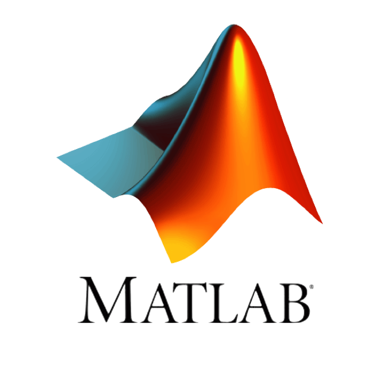
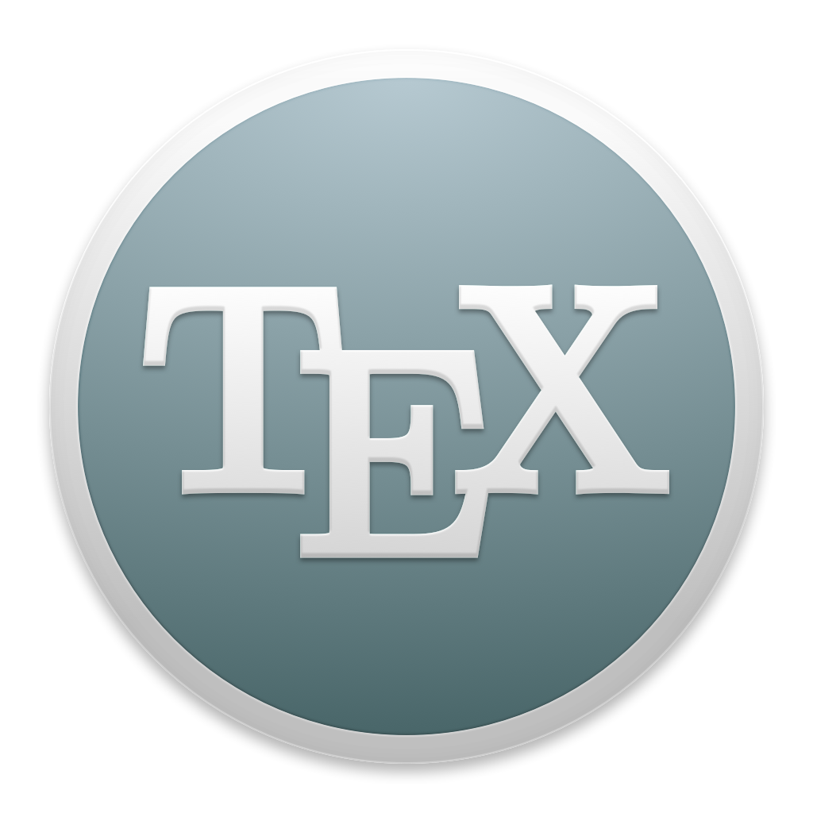
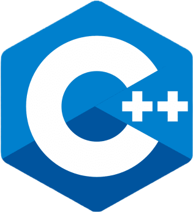
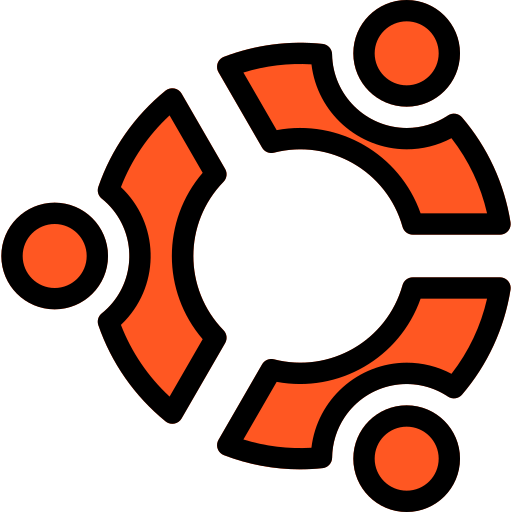
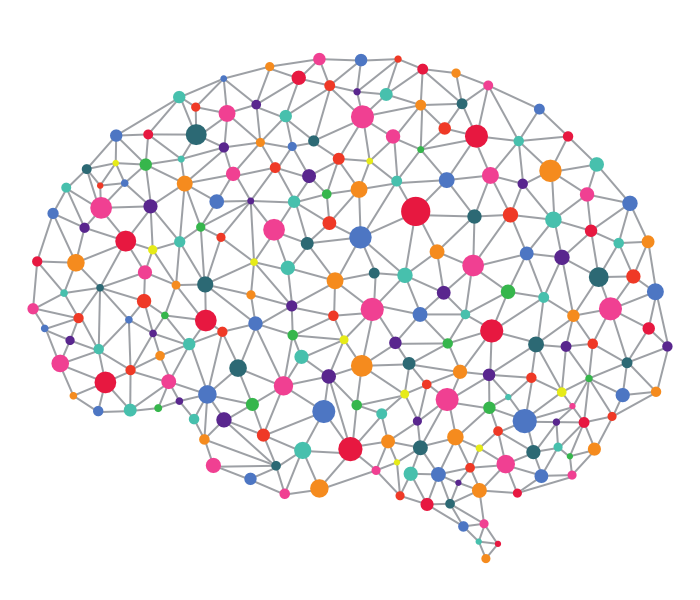
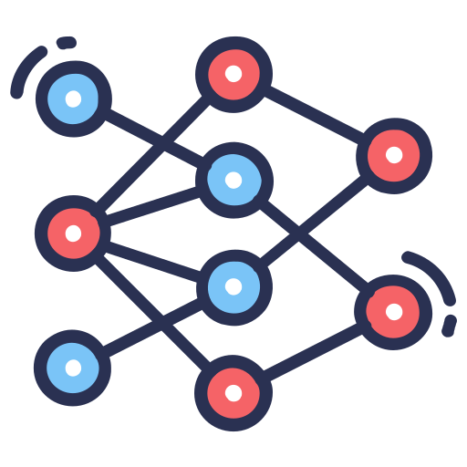
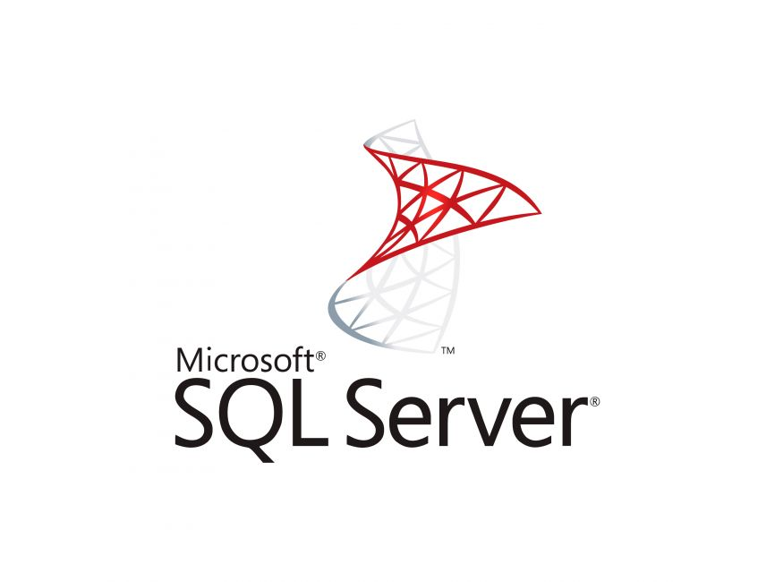
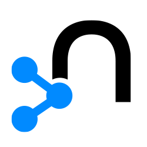
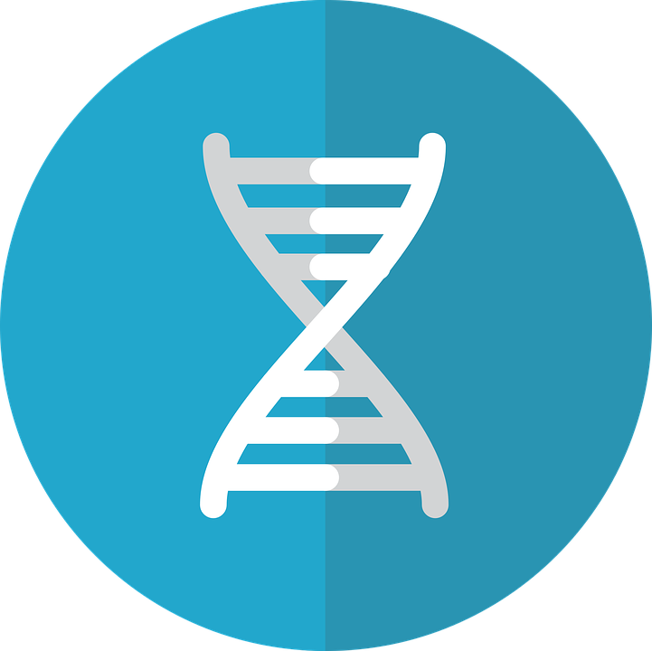
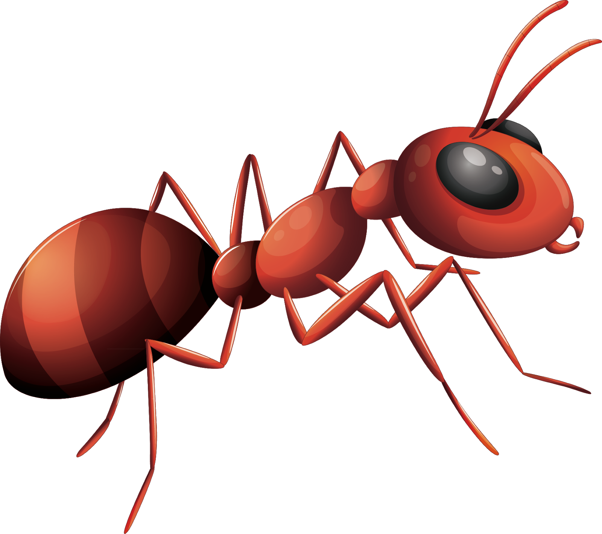

# Grad Chronicles

Grad Chronicles is a repository for more of the important courses, if not all (important is subjective to me over here), that I have taken in my undergrad life. This repository keeps everything easily accessible, and organized.

## Directory Structure
<!--  -->
#### [EE/CE 354/361 - Introduction to Probability and Statistics](CE-EE-361-354-Probability-and-Statistics)
- **Exams**
- **Homeworks**
- **Programming Assignments**
- **Quizzes**

#### [CE/MATH 362/322 - Statistics and Inferencing](CE-Math-362-322-Stats-and-Inferencing) (Iftikhara Pro Max) 
- **Activities**
- **Exams**
- **Homeworks**
- **Lectures**
- **Student Engagement Level (from Fall 2022)**

#### [CS101 - Algorithmic Problem Solving (Programming Fundamentals)](CS101)  
- **Fall 2021 Iteration**
- **Fall 2023 Iteration (TA)**
    - **Lab Worksheets + Hackerrank Labs**
    - **Midterms**
    - **Practice Worksheets + Hackerrank Labs**
    - **Seminar Worksheets**

#### [CS102 - Data Structures and Algorithms](CS102-DSA) (Spring 2022 and Fall 2022 [TA])  
- **Homeworks**
- **Labs**
- **Quizzes**
- **README.md**

#### [CS113 - Discrete Mathematics](CS113-Discrete-Mathematics) (Ducks on Meth)   
- **Spring 2022 Iteration**
- **Spring 2023 Iteration (TA)**
- **README.md**

#### [CS130 - Digital Logic and Design](CS130-Digital-Logic-Design)  
- **Homeworks**
- **Labs**
- **Mid**

#### [CS201 - Data Structures II](CS201-Data-Structures-II)  
- **Homeworks (0-4)**
- **Lectures**
- **Quizzes**
- **Weekly Quizzes**
- **README.md**

#### [CS212 - Nature of Computation](CS212-Nature-of-Computation-Fall23) (Cats Compute - on Catnip) 
- **Assignments** 
- **Finals**
- **Midterms**
- **Quizzes**
- **Book Solutions**
- **Weekly Challenges**
- **Course Book**
- **README.md**

#### [CS224 - Object Oriented Programming and Design Methodologies](CS224-Object-Oriented-Programming) (OOPS)  
- **Fall 2021 Iteration (Credit to [Meesum Ali Qazalbash](https://github.com/qazalbash/))**
- **Fall 2022 Iteration**
- **Fall 2023 Iteration (TA)**
- **Notes**
- **README.md**

#### [CS232 - Operating Systems](CS232-Operating-Systems-Fall23) (U either turn out like me, or retain your sanity)     
- **Finals**
- **Labs**
- **Lectures**
- **Ostep Codes**
- **Quizzes**
- **Course Book**
- **README.md**

#### [CS313 - Computational Complexity Theory](CS313-Computational-Complexity-Theory) 
- **Assignments**
- **Exams**
- **Lectures**
- **Quizzes**
- **Slides**

#### [CS316 - Introduction to Deep Learning](CS316-CE365-Deep-Learning)   
- **Activities**
- **Exams**
- **Lab Midterm**
- **Labs**
- **Previous Exams**
- **Quizzes**
- **Slides**

#### [CS330 - Computer Architecture](CS330-Computer-Architecture)   
- **Homeworks**
- **Quizzes**
- **Lab Codes**
- **Lab Test Benches**
- **Pipelined Processor**
- **Single Cycle Processor** 


#### [CS335 - Database Management Systems](CS335-Database-Management-Systems) (Query Much?)      
- **Homeworks**
- **Labs**
- **README.md**

#### [CS343 - Graph Data Science](CS343-Graph-Data-Science) 
- **Activities**
- **Homeworks**
- **Lectures**
- **Midterm**
- **Quizzes**

#### [CS/CE 353/374 - Software Engineering](CS353-CE374-Software-Engineering)
- **[Final Project - PAWSTrack](https://github.com/AliMuhammadAsad/pawstrack/)**
- **Slides**
- **Final Exams and Midterms etc**

#### [CS412 - Algorithms: Design and Analysis](CS412-Algorithms)  
- **Books**
- **Codes**
- **Homeworks**
- **Lectures**
- **Midterm**
- **Problem Sets**
- **Quizzes**
- **Spring 22 and 23**
- **Weekly Challenges**
- **Notes**

#### [CS435 - Generative AI: Security, Ethics, and Governance](CS435-Generative-AI)
- **Assignments**
- **Some Codes**
- **Slides**

#### [CS451 - Computational Intelligence](CS451-Computational-Intelligence)       
- **[Assignment 01 - Evolutionary Algoritm on TSP and JSSP](https://github.com/AliMuhammadAsad/Evolutionary-Algorithms)**
- **[Assignment 02 - Graph Coloring using Ant Colony Optimisation](https://github.com/AliMuhammadAsad/GC-ACO)**
- **[Assignment 02 - Particle System Visualization](https://github.com/AliMuhammadAsad/Particle-System-Visualization)**
- **[Assignment 03 - Self Organizing Maps](https://github.com/AliMuhammadAsad/Self-Organizing-Map)**
- **[Assignment 03 - Frozen Lake Navigation using Reinforcement Learning](https://github.com/AliMuhammadAsad/FrozenLake-Navigation-Using-RL)**
- **Lectures**
- **Presentations**
- **Quizzes**
- **Book and Notes**

#### [CS452 - Probabilistic Graph Models](CS452-Probabilistic-Graphical-Models)
- **Assignments**
- **Exams**
- **Genie Files**
- **Quizzes**
- **Slides**

#### [EE/CE-468 Mobile Robotics](EE-CE-468-Mobile-Robotics) (I dare you xD)   

- **[Final Project - Smart Walking Cane for the Visually Impaired](https://github.com/AliMuhammadAsad/Mobile-Robotics-Project)**
- **Assignments** 
    - **Assignment1**
    - **Assignment2**
    - **Assignment3**
    - **Assignment4**
- **Lectures**
- **Quizzes**

#### [MATH-205 Linear Algebra](MATH-205-Linear-Algebra) (Wahiyat Tareen Course)
- **Homeworks and Assignments**
- **Lectures**
- **Mids and Finals**
- **Quizzes** (Fall22 and Spring23)
    - **Sir Aeyaz** 
    - **Miss Sajal**

#### [MGMT-323 Supply Chain Management](MGMT323-Supply-Chain)
- **Activities**
- **Assignments**
- **Previous Stuff**
- **Slides**


<!-- 
```
Grad Chronicles
├── EE/CE 354/361 - Introduction to Probability and Statistics 
│   ├── Exams
│   ├── Homeworks
│   ├── Programming Assignments
│   └── Quizzes
|
├── CE/MATH 362/322 - Statistics and Inferencing (Iftikhara Pro Max)
│   ├── Activities
│   ├── Exams
│   ├── Homeworks
│   ├── Lectures
│   └── Student Engagement Level (from Fall 2022)
|
├── CS101 - Algorithmic Problem Solving (Programming Fundamentals)
│   ├── Fall 2021 Iteration
│   └── Fall 2023 Iteration (TA)
│       ├── Lab Worksheets + Hackerrank Labs
│       ├── Midterms
│       ├── Practice Worksheets + Hackerrank Labs
│       └── Seminar Worksheets
│   
├── CS102 - Data Structures and Algorithms (Spring 2022 and Fall 2022 [TA])
│   ├── Homeworks
│   ├── Labs
│   ├── Quizzes
│   └── README.md
│
├── CS113 - Discrete Mathematics (Ducks on Meth)
│   ├── Spring 2022 Iteration
│   ├── Spring 2023 Iteration (TA)
|   └── README.md
|
├── CS130 - Digital Logic and Design
|   ├── Homeworks
|   ├── Labs
|   └── Mid
│
├── CS201 - Data Structures II
│   ├── Homework 0
│   ├── Homework 1
│   ├── Homework 2
│   ├── Homework 3
│   ├── Homework 4
│   ├── Lectures
│   ├── Quizzes
│   ├── Weekly Quizzes
│   └── README.md
|
├── CS212 - Nature of Computation (Cats Compute - on Catnip)
│   ├── Assignments
│   ├── Finals
│   ├── Midterms
│   ├── Quizzes
│   ├── Book Solutions
│   ├── Weekly Challenges
│   ├── Course Book
│   └── README.md
|
├── CS224 - Object Oriented Programming and Design Methodologies (OOPS)
│   ├── Fall 2021 Iteration (Credit goes to [Meesum Ali Qazalbash](https://github.com/qazalbash/))
│   ├── Fall 2022 Iteration
│   ├── Fall 2023 Iteration (TA)
│   ├── Notes
|   └── README.md
|
├── CS232 - Operating Systems (U either turn out like me, or retain your sanity)
│   ├── Finals
│   ├── Labs
│   ├── Lectures
│   ├── Ostep Codes
│   ├── Quizzes
│   ├── Course Book
|   └── README.md
|
├── CS330 - Computer Architecture
|
└── CS335 - Database Management Systems (Query Much?)
    ├── Homeworks
    ├── Labs
    └── README.md

``` -->
